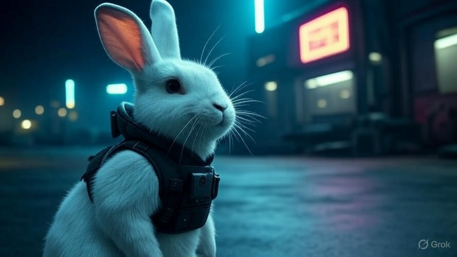

# Rabbit-C2

*Note: The above image is a placeholder styled as a circular logo, similar to the agent photo in the dashboard. Replace with `bg.jpg` for the final version.*

## Overview

This project is yet another upcoming Command and Control (C2) server, designed to provide a robust and user-friendly interface for managing agents and their tasks.

## Features
- View and manage connected agents.
- Assign and monitor job queues with commands and outputs.
- Interact with a responsive web interface for real-time control.

Built with a focus on simplicity and extensibility, this C2 server leverages modern web technologies and a Redis backend to facilitate agent communication and task execution. Stay tuned for further developments as we enhance functionality and refine the
